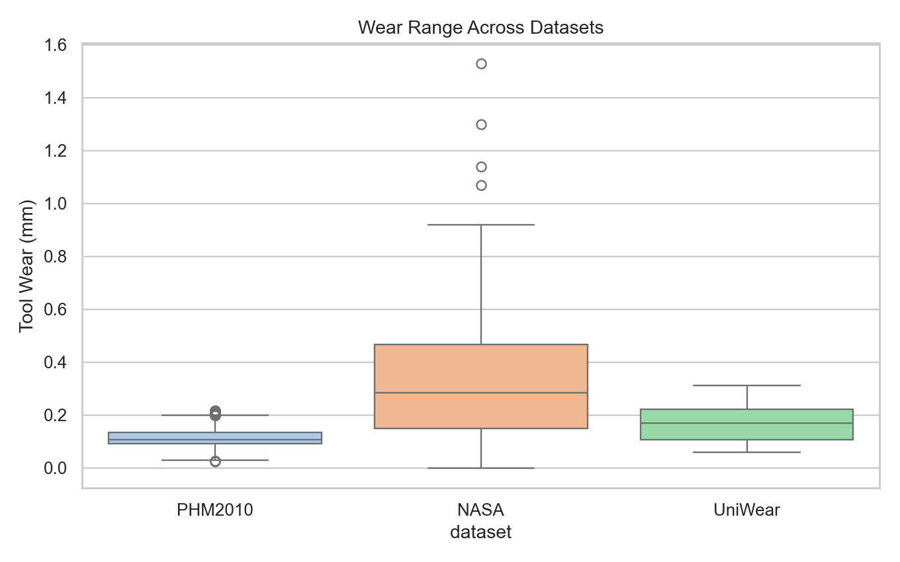
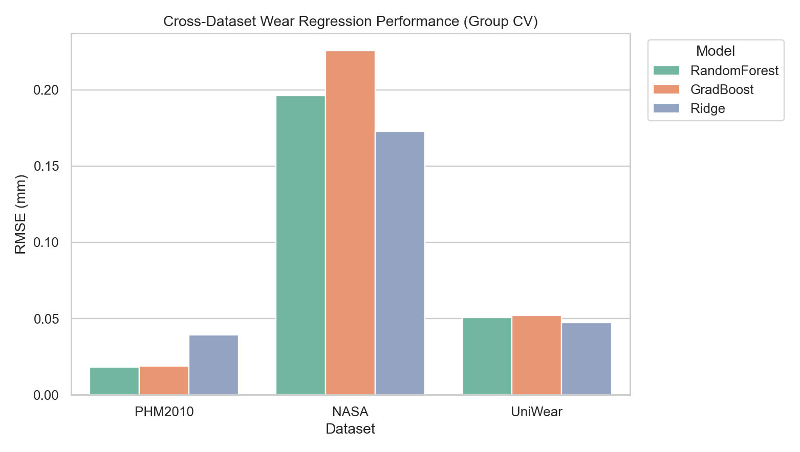

# Cross-Dataset Tool Health, Failure Marker, and Life Simulation Study

## Objective

Develop a reproducible pipeline that:
- learns wear from sensor signals,
- finds early failure markers,
- and builds a parameter-driven simulator for tool-life optimization.

Datasets used in this repository:
- PHM 2010 challenge (`c1,c4,c6` labeled training; `c2,c3,c5` unlabeled test),
- NASA milling dataset,
- UniWear merged dataset + NUAA high-resolution parameterized bundle.

## Dataset Inventory

Dataset profile table: `results/cross_dataset_research/tables/dataset_profiles.csv`

## Methods

### 1. Feature Extraction
- Per sensor channel: mean, std, RMS, abs-mean, peak-to-peak, skew-like, kurt-like, crest, quantiles.
- Frequency markers: FFT energy, dominant bin, centroid, entropy.
- PHM raw files were downsampled by 25 for computational efficiency while preserving trend statistics.

### 2. Wear Regression
- Models: Ridge, RandomForest, GradientBoosting.
- Validation: Grouped CV (leave-groups-out style):
  - PHM grouped by cutter (c1/c4/c6),
  - NASA grouped by case,
  - UniWear grouped by experiment tag.

### 3. Failure Marker Mining
- Binary failure label from wear threshold (dataset-specific):
  - PHM: >= 0.150 mm
  - NASA: >= 0.300 mm
  - UniWear: >= 0.220 mm
- Classifier: RandomForestClassifier with class balancing and grouped CV.
- Marker candidates ranked by single-feature AUC and healthy vs failed separation.

### 4. Parameter-Life Simulator (NUAA Bundle)
- Learned model: wear = f(time, feed_per_tooth, spindle_speed, axial_cutting_depth).
- Life criterion: first time predicted wear reaches threshold.
- Threshold used for simulator: 0.250 mm.

## Results

### A. Regression Performance

All metrics: `results/cross_dataset_research/tables/all_datasets_regression_metrics.csv`

- PHM best model: **RandomForest**, RMSE=0.0181, R2=0.7244
- NASA best model: **Ridge**, RMSE=0.1728, R2=0.2734
- UniWear best model: **Ridge**, RMSE=0.0475, R2=0.1437

Regression scatter plots:
- `plots/phm2010_regression_scatter.png`
- `plots/nasa_regression_scatter.png`
- `plots/uniwear_regression_scatter.png`

### B. Failure Classification

- PHM ROC-AUC=0.9671, F1=0.7602, failure-rate=0.1725
- NASA ROC-AUC=0.9141, F1=0.7857, failure-rate=0.4795
- UniWear ROC-AUC=0.7350, F1=0.2873, failure-rate=0.2743

Marker tables (with direction and threshold):
- `tables/phm2010_failure_markers.csv`
- `tables/nasa_failure_markers.csv`
- `tables/uniwear_failure_markers.csv`

PHM challenge unlabeled test cutters (model-scored wear trend):
- c2 predicted wear range: 0.0326 to 0.2053 mm (mean 0.1207 mm)
- c3 predicted wear range: 0.0336 to 0.1693 mm (mean 0.1055 mm)
- c5 predicted wear range: 0.0389 to 0.1714 mm (mean 0.1119 mm)
- Source: `tables/phm2010_test_cutters_predicted_wear.csv`

Top marker plots:
- `plots/phm2010_failure_markers.png`
- `plots/nasa_failure_markers.png`
- `plots/uniwear_failure_markers.png`

### C. Simulator and Parameter Optimization

- NUAA simulator CV: RMSE=0.0517, MAE=0.0426, R2=-0.0176
- Parameter-life heatmap: `plots/nuaa_life_heatmap.png`
- Ranked life table: `tables/nuaa_simulated_life_table.csv`

Best setting in observed parameter grid:
- feed_per_tooth=0.050, spindle=1750 rpm, depth=3.0 mm, life=2974.7 s

Worst setting in observed parameter grid:
- feed_per_tooth=0.055, spindle=1750 rpm, depth=3.5 mm, life=516.0 s

### D. Taylor-like Life Equation (Empirical)

From observed NUAA experiment lives (threshold crossing), fitted in log-space:

`log(T) = b0 + b1*log(spindle_speed) + b2*log(feed_per_tooth) + b3*log(axial_depth)`

Equivalent form:

`T ~= 1.573e+28 * spindle_speed^(-9.2806) * feed_per_tooth^(-4.6482) * axial_depth^(-2.0471)`

Log-space R2 = 0.7579

## Practical Failure-Marker Guidance

- Consistent indicators across datasets are vibration-energy growth, AE/force dispersion rise, and crest-factor increase.
- Use two-level alarms for deployment:
  - Warning when marker thresholds are crossed with moderate confidence.
  - Failure risk when classifier probability > 0.7 over consecutive windows.
- For PHM test cutters (`c2,c3,c5`), the trained PHM model can score every run for trend-based risk even without wear labels.

## Files Generated

- Main metrics summary: `results/cross_dataset_research/metrics_summary.json`
- Detailed tables: `results/cross_dataset_research/tables/`
- Figures: `results/cross_dataset_research/plots/`
- This report: `results/cross_dataset_research/tool_health_failure_research_report.md`

## Limitations and Next Experiments

- Cross-dataset transfer is constrained by sensor and operating-regime mismatch.
- PHM wear range is lower than NASA, so thresholding must remain dataset-aware.
- Next steps: sequence models (TCN/LSTM/Transformer) and uncertainty-calibrated RUL forecasting.
